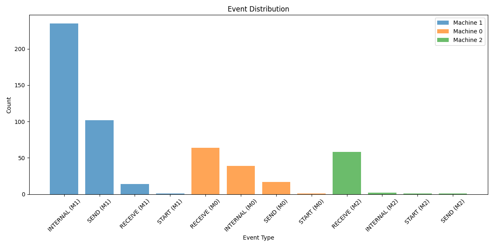
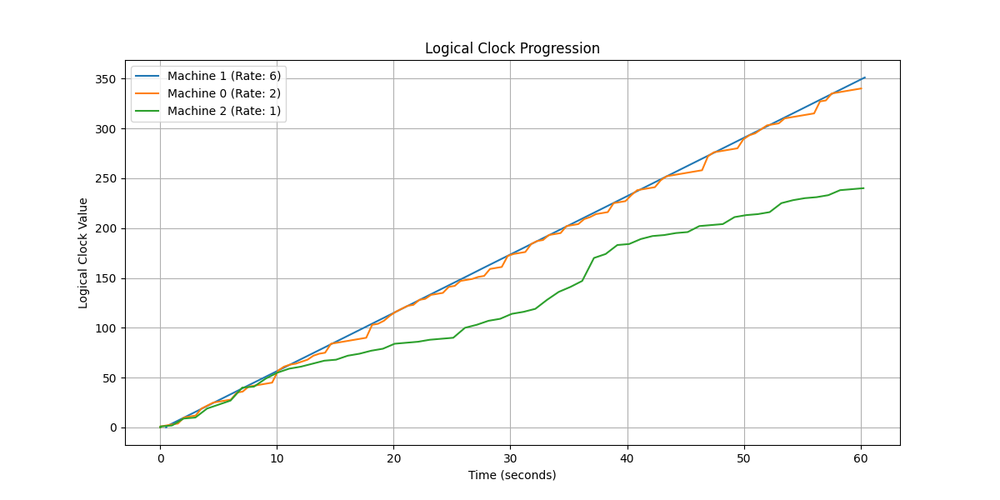
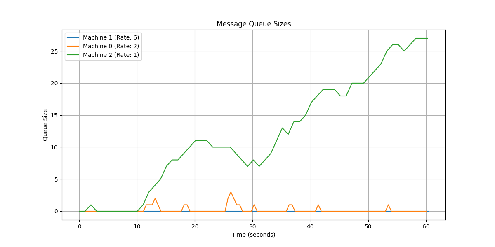
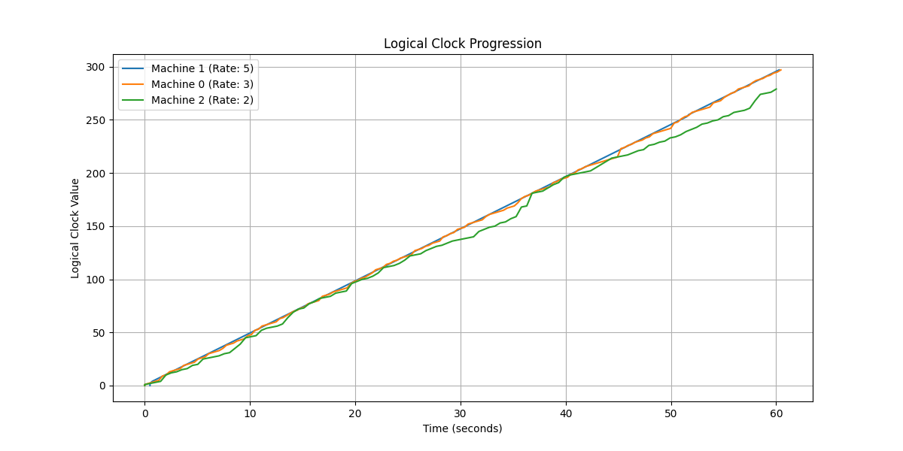

# Engineering Notebook

## 2/28/25

### Entry 1
so today we started working on this distributed system thing with logical clocks. we thought using threads and a shared queue would be a good idea to simulate the machines talking to each other. but wow, threads are a pain. synchronization issues everywhere. managing shared state is like herding cats. maybe threads aren't the best choice here? i mean, every time we try to coordinate the threads, something else breaks. it's like playing whack-a-mole with bugs. note to self: look into alternatives that might be less of a headache.

### Entry 2
okay, so we need a new plan. threads are out. what about processes and sockets? processes are like their own little worlds, right? and sockets can pretend to be a network. sounds promising. let's give it a shot. i think this might actually work better because processes don't share memory, so we won't have to deal with all that synchronization nonsense. plus, sockets are kinda cool because they let us simulate real network communication. note to self: read up on socket programming basics.

## 3/1/25

### Entry 1
made the switch to processes and sockets today. setting up sockets is a bit of a headache though. retries, message formats, ugh. but hey, it's working. kinda. sockets are finicky but they might just do the trick. i spent a good chunk of the day just trying to get the processes to talk to each other without crashing. it's like teaching toddlers to share toys. note to self: make sure to handle connection errors gracefully.

### Entry 2
added logical clock updates and logging. lamport's rules are pretty neat. logs are starting to look useful. gotta make sure we log everything we need though. logging is like our lifeline for figuring out what's going on. i set up the logging to capture every event, including sends, receives, and internal events. this way, we can track the logical clock's progression and see how it aligns with the system time. note to self: double-check that all log entries are formatted correctly.

## 3/2/25

### Entry 1
tested the system with a few virtual machines. three of them chatting away over sockets. message delivery is a bit iffy. clocks aren't syncing perfectly. error handling is gonna be key here. sockets are tricky. i noticed that sometimes messages get lost or delayed, which throws off the clock synchronization. need to figure out a way to handle these network hiccups. note to self: investigate how to implement retries or acknowledgments for message delivery.

### Entry 2
started analyzing logs for clock jumps and drifts. wrote a script to parse logs. parsing is harder than it sounds. logs are messy. but we need them to make sense of the system. the script calculates the difference between logical clock values to identify jumps and drifts. it's a bit rough around the edges, but it's a start. note to self: refine the parsing logic to handle edge cases and improve accuracy.

## 3/3/25

### Entry 1
refined the log parsing and analysis. logs come in all shapes and sizes. added more detail to the analysis. edge cases are everywhere. parsing needs to be flexible to handle all the weird stuff. i added some error handling to the script to catch malformed log entries and skip them. this should help prevent the analysis from crashing unexpectedly. note to self: test the script with a variety of log files to ensure robustness.

### Entry 2
ran experiments with different configurations. changed clock rates and internal event probabilities. results are all over the place. consistency is hard. system behavior changes a lot with different settings. i ran a series of tests to see how the system behaves under different conditions. it's fascinating to see how small changes in parameters can lead to big differences in outcomes. note to self: document the results of each experiment for future reference.

## 3/4/25

### Entry 1
wrapping up the implementation. getting ready for the demo. everything's gotta work together smoothly. testing and documentation are super important. can't have things falling apart during the demo. i spent the day running final tests and making sure all the documentation is up to date. the README and Makefile should help others understand how to run the system and what to expect. note to self: review the demo script to ensure a smooth presentation.

### Entry 2
looking back on the whole process. learned a lot. writing it all down in this notebook. iterative development and testing saved us. lots of challenges but we made it through. it's been a wild ride, but i'm proud of what we've accomplished. this project taught me the value of persistence and the importance of learning from mistakes. note to self: keep this notebook as a reminder of the journey and the lessons learned. 

### Answers to Questions
Prompt: While working on this, keep a lab notebook in which you note the design decisions you have made. Then, run the scale model at least 5 times for at least one minute each time. Examine the logs, and discuss (in the lab book) the size of the jumps in the values for the logical clocks, drift in the values of the local logical clocks in the different machines (you can get a god’s eye view because of the system time), and the impact different timings on such things as gaps in the logical clock values and length of the message queue. Observations and reflections about the model and the results of running the model are more than welcome.

Once you have run this on three virtual machines that can vary their internal times by an order of magnitude, try running it with a smaller variation in the clock cycles and a smaller probability of the event being internal. What differences do those variations make? Add these observations to your lab notebook. Play around, and see if you can find something interesting.

Answers:
* We noticed that when machines had similar clock rates, they would have the roughly the same logical clock over time (the difference is bounded). This is especially true if most of the work is internal. However, when we turned the probability of processing an internal event down, the slow machine was overwhelmed and could not catch up, because it could not process its message queue fast enough.
* Obviously, the slowest machine always had the most message in the queue. In one experiment, we had a machine with clock rate 1 with machines with clock rates of 4 and 5, and it was overwhlemed by messages.
* Small variation resulted in logical clocks that were very close to each other throughout time. 
* There are small jumps because we receive messages often enough to catch up in small intervals. The biggest jumps are probably by 5.
* Slow machines spend a lot of their time processing received messages. See trial 4 for the largest effect! Also, generally, the slower machine will do this.

## Some useful graphs

### Normal trial example:

### Small Internal Probability - Variations

### 5 Machines - Variations
